# (C# 코딩) 파일 비교 프로그램 (FileCompare)

## 목차
1. 개요
2. 과제 1
3. 과제 2
4. 과제 3
5. 과제 4

---

## 1. 개요
본 실습은 C# Windows Forms(.NET) 환경에서 두 개의 폴더를 비교하고 파일을 복사하는 파일 비교 도구(File Compare Tool)를 구현하는 과제이다. Visual Studio를 사용하여 UI 구성, 파일 목록 표시, 파일 비교 및 복사 기능을 단계적으로 구현한다.

- 사용한 플랫폼  
  : C#, .NET Windows Forms, Visual Studio, GitHub

- 사용한 컨트롤  
  : Label, TextBox, Button, ListView, SplitContainer, Panel

- 사용한 기술과 구현 기능  
  : Visual Studio를 이용한 UI 디자인  
  : 파일 시스템 접근 (Directory, File 클래스)  
  : 이벤트 기반 프로그래밍

- 수업 중 사용한 주요 클래스  
  - Directory: 폴더 내 파일 목록 조회
  - File: 파일 복사 처리
  - DateTime: 파일 수정 시간 비교

- 실습 중 구현한 기능  
  : 두 폴더 파일 목록 비교  
  : 파일 존재 여부 및 수정일 기준 색상 표시  
  : 선택 파일 복사 기능  
  : 하위 폴더 포함 전체 복사 기능  

---

## 2. 과제 1

### 실행 화면
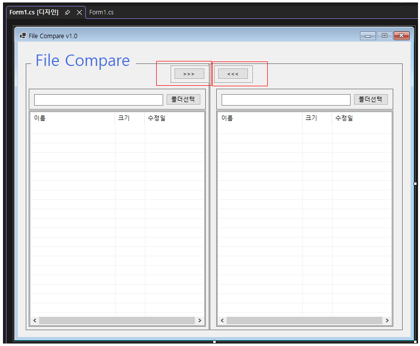
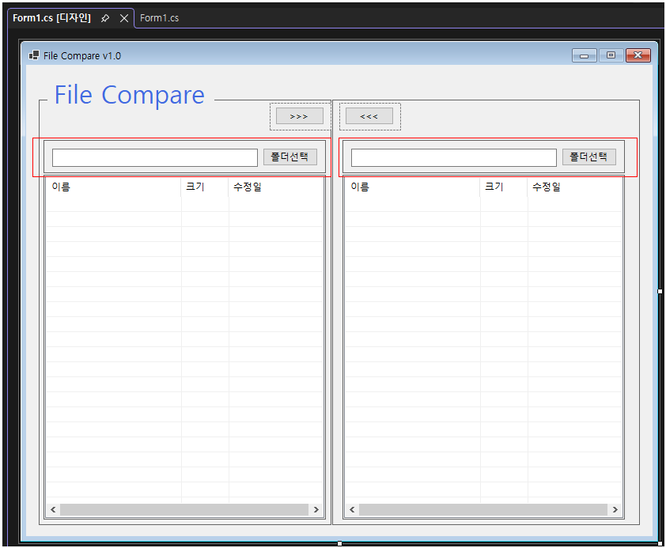
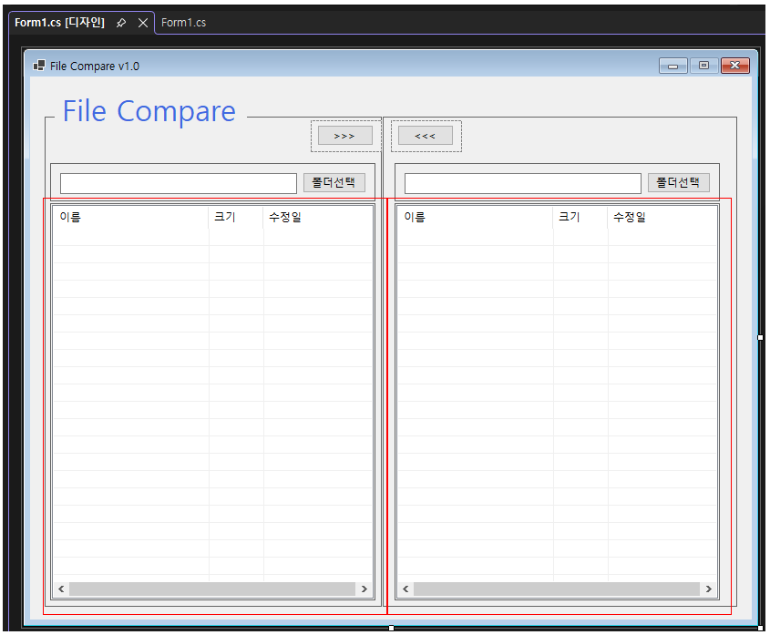
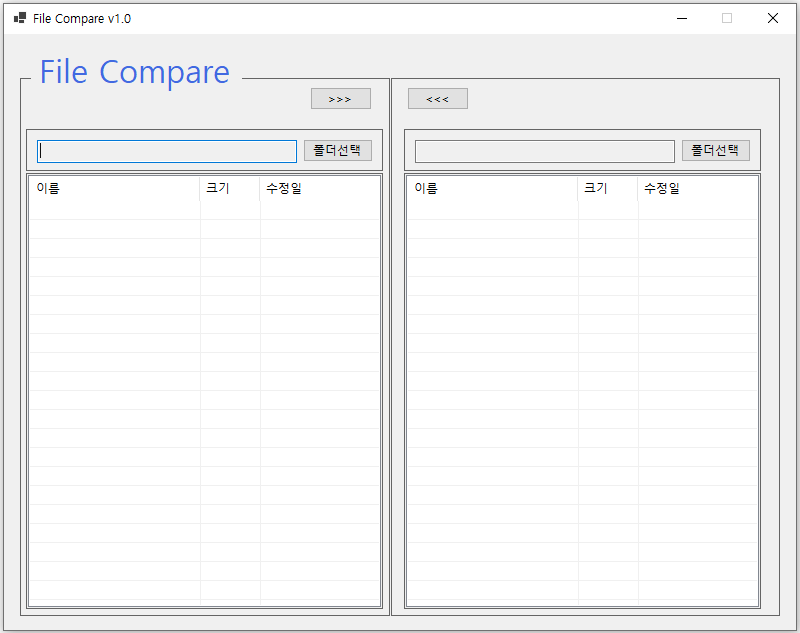

### 과제 내용
- SplitContainer를 이용하여 좌측과 우측 영역으로 화면을 분할하고 전체 UI 구조를 설계한다.
- Label, TextBox, Button 컨트롤을 배치하여 프로그램 이름과 폴더 경로 입력 영역을 구성한다.
- 중앙 영역에 Panel을 활용하여 화살표 버튼(파일 복사 버튼)을 배치하고 좌우 영역과 구분되도록 한다.
- ListView 컨트롤을 추가하여 좌측과 우측 폴더의 파일 목록이 표시될 수 있는 구조를 완성한다.
- 각 컨트롤은 lblAppName, txtLeftDir, txtRightDir, lvwLeftDir, lvwRightDir, btnCopyFromLeft, btnCopyFromRight 등 의미 있는 이름으로 지정한다.

### 구현 내용과 기능 설명
- SplitContainer를 중심으로 좌측(ListView + TextBox + Button)과 우측 영역을 대칭 구조로 구성하였다.
- Label(lblAppName)을 통해 프로그램 이름(File Compare)을 상단에 표시하여 UI의 목적을 명확히 하였다.
- 각 영역에는 TextBox(txtLeftDir, txtRightDir)와 Button(btnLeftDir, btnRightDir)을 배치하여 폴더 경로를 입력하거나 선택할 수 있도록 구현하였다.
- 중앙에는 Panel을 별도로 구성하고 그 안에 btnCopyFromLeft, btnCopyFromRight 버튼을 배치하여 위치가 흐트러지지 않도록 설계하였다.
- 좌우 영역 하단에는 ListView(lvwLeftDir, lvwRightDir)를 배치하여 이후 파일 목록을 출력할 수 있는 기반 UI를 완성하였다.
- 컨트롤 배치와 이름을 일관성 있게 구성하였다.

---

## 3. 과제 2

### 실행 화면

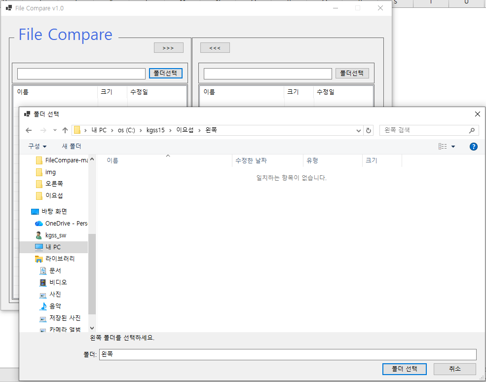
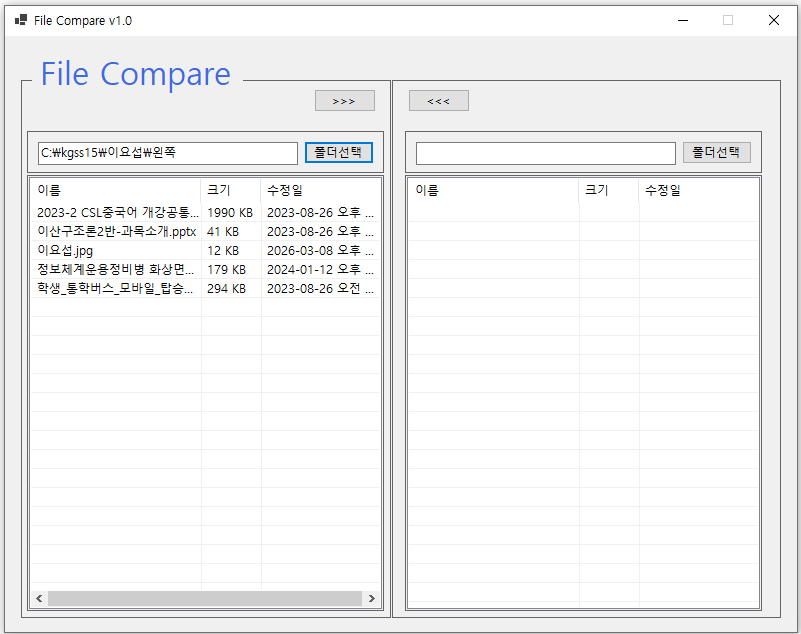
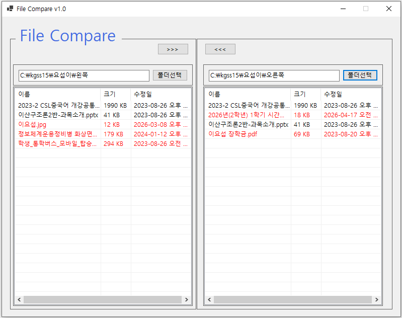
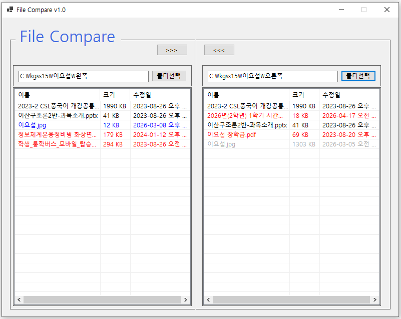

### 과제 내용
- 좌측과 우측 영역에 폴더 경로를 입력하거나 선택할 수 있도록 TextBox와 Button을 구성한다.
- 선택한 폴더의 파일 목록이 ListView에 표시되도록 구현한다.
- 양쪽 폴더의 파일 목록을 동시에 표시하여 비교가 가능하도록 구성한다.
- 파일 존재 여부 또는 차이에 따라 색상을 다르게 표시하여 구분할 수 있도록 한다.

### 구현 내용과 기능 설명
- 폴더 선택 기능과 파일 리스트 표시 기능을 중심으로 구현하였다.
- Button 클릭 이벤트를 통해 FolderBrowserDialog를 사용하여 폴더를 선택하고 TextBox에 경로를 표시하도록 구현하였다.
- 선택된 폴더 경로를 기준으로 Directory 클래스를 이용하여 파일 목록을 가져와 ListView에 출력하였다.
- 좌측과 우측 ListView를 동일한 구조로 구성하여 파일 비교가 가능하도록 UI를 구성하였다.
- 파일의 존재 여부 및 상태에 따라 ListView 항목의 색상을 변경하여 시각적으로 구분할 수 있도록 구현하였다.

---

## 4. 과제 3

### 실행 화면
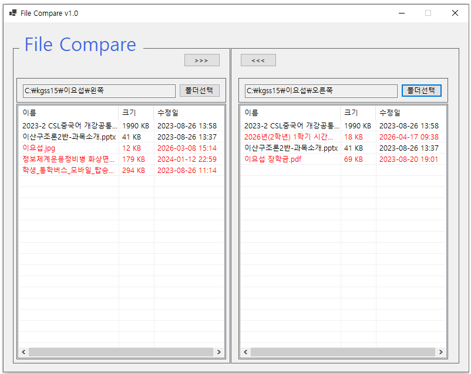
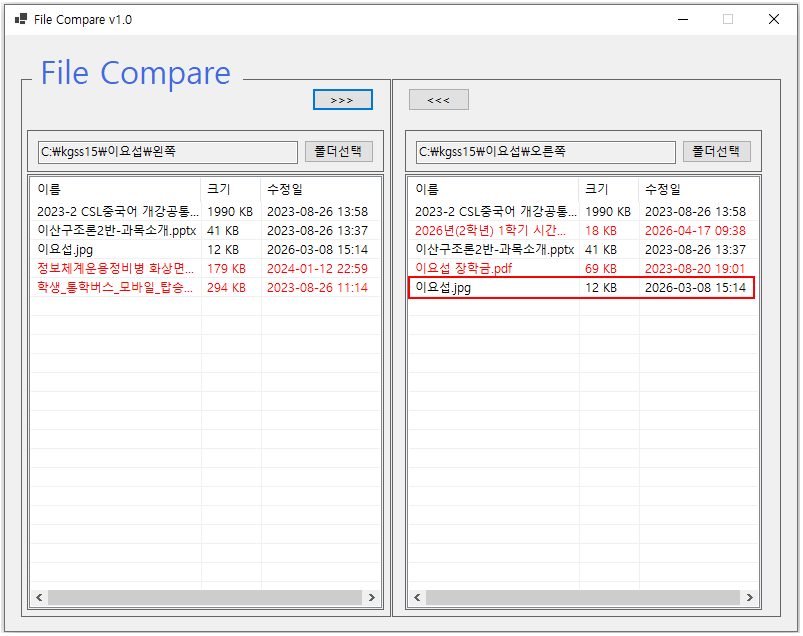
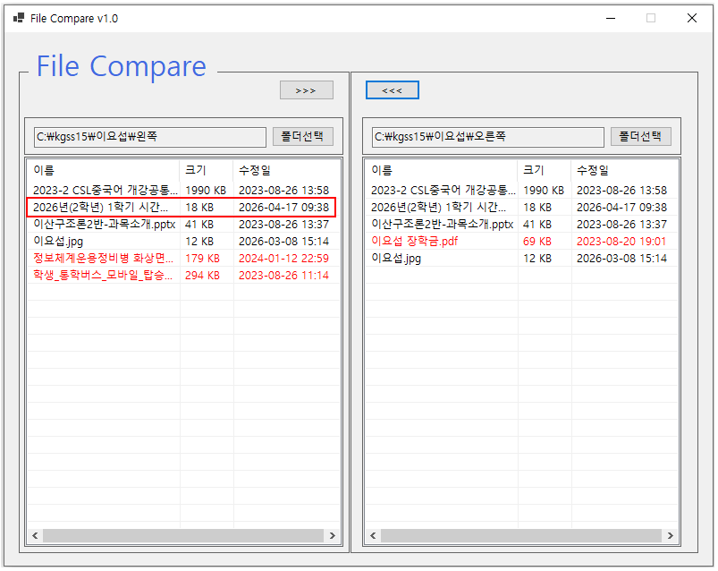
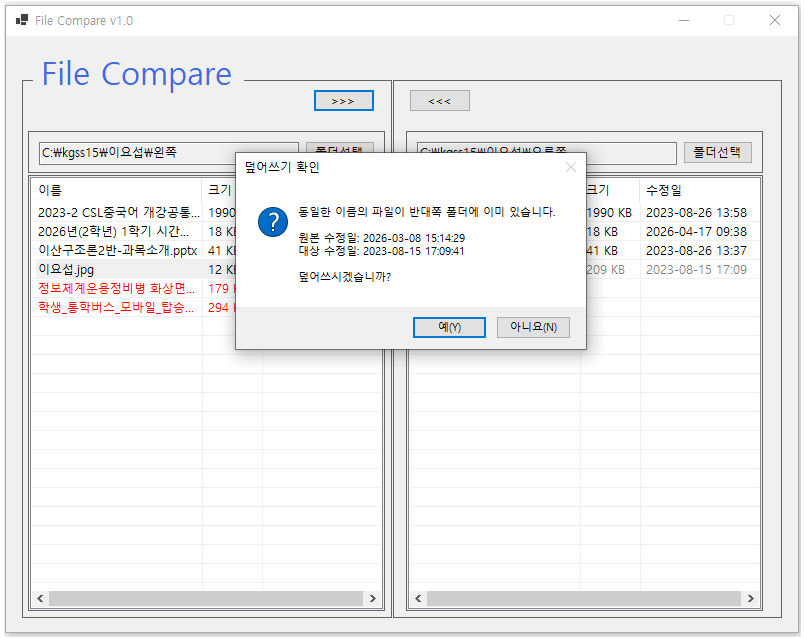

### 과제 내용
- ListView에서 파일을 선택하고 선택된 파일을 반대쪽 폴더로 복사하는 기능을 구현한다.
- 좌측과 우측 폴더 간 파일을 이동할 수 있도록 양방향 복사 기능을 구성한다.
- 동일한 파일이 존재할 경우 파일의 수정 날짜를 비교하여 최신 여부를 판단한다.
- 파일이 이미 존재하는 경우 사용자에게 덮어쓰기 여부를 확인받도록 구현한다.
- 복사 이후 변경된 내용을 화면에 반영하도록 구성한다.

### 구현 내용과 기능 설명
- ListView의 SelectedItems를 이용하여 선택된 파일의 이름과 경로 정보를 추출하도록 구현하였다.
- 파일 경로는 Path.Combine을 활용하여 대상 폴더와 파일명을 결합하여 생성하였다.
- 파일 복사는 File.Copy 메서드를 사용하여 처리하고, 예외 발생 가능성을 고려하여 조건 분기를 구성하였다.
- 기존 파일이 존재하는 경우 FileInfo 객체를 활용하여 LastWriteTime을 비교하고, 결과에 따라 MessageBox를 통해 사용자 입력을 받도록 구현하였다.
- 복사 작업이 완료된 이후에는 Directory 정보를 다시 읽어 ListView를 갱신하는 방식으로 화면을 최신 상태로 유지하였다.

---

## 5. 과제 4

### 실행 화면
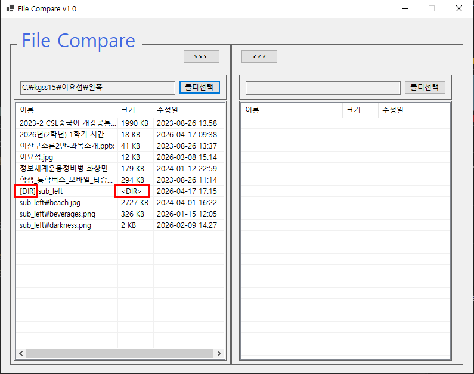
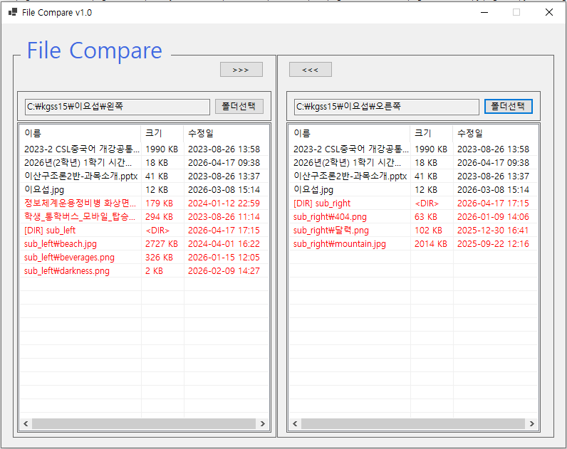
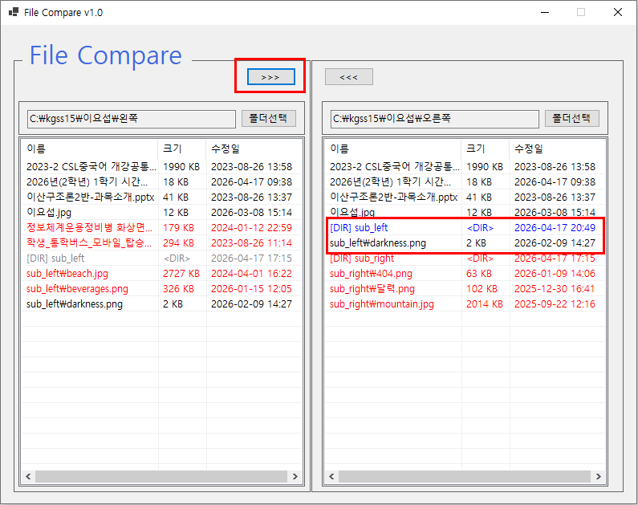
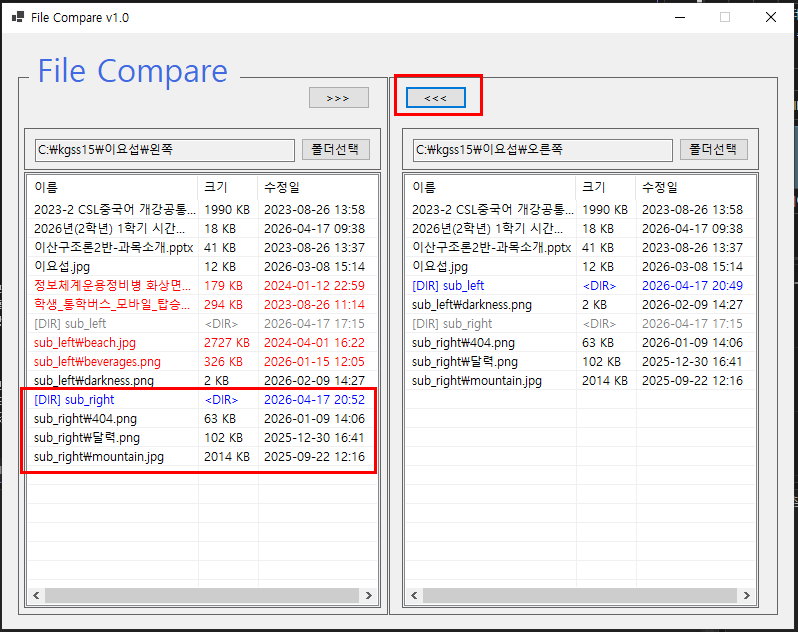

### 과제 내용
- 하위 폴더까지 포함하여 비교 및 복사가 가능하도록 구현한다.
- 폴더를 하나의 항목처럼 처리한다.
- 복사 시 하위 폴더의 모든 내용을 포함한다.

### 구현 내용과 기능 설명
- Directory 클래스의 SearchOption.AllDirectories 옵션을 사용하여 하위 폴더와 파일을 재귀적으로 탐색하도록 구현하였다.
- 탐색된 결과는 루트 폴더 기준의 상대 경로로 변환하여 ListView에 표시되도록 구성하였다.
- 폴더는 [DIR] 접두어와 `<DIR>` 크기 표시를 통해 일반 파일과 구분되도록 하였다.
- 파일과 폴더 모두를 대상으로 존재 여부 및 수정일 비교를 수행하여 색상으로 상태를 구분하였다.
	- 비교 대상에 존재하지 않는 경우: 빨간색
	- 현재 폴더의 항목이 더 최신인 경우: 파란색
	- 반대쪽이 더 최신인 경우: 회색
- ListView에서 선택한 항목이 파일일 경우에는 일반 파일 복사를 수행하고, 폴더일 경우에는 내부 파일 및 하위 폴더를 포함하여 재귀적으로 전체 복사가 이루어지도록 구현하였다.
- 동일한 이름의 파일 또는 폴더가 대상 경로에 존재할 경우, 원본과 대상의 수정일 정보를 비교하여 덮어쓰기 여부를 사용자에게 확인받는 기능을 추가하였다.
- 복사 작업 완료 후에는 양쪽 폴더의 내용을 다시 조회하여 화면이 즉시 갱신되도록 처리하였다.